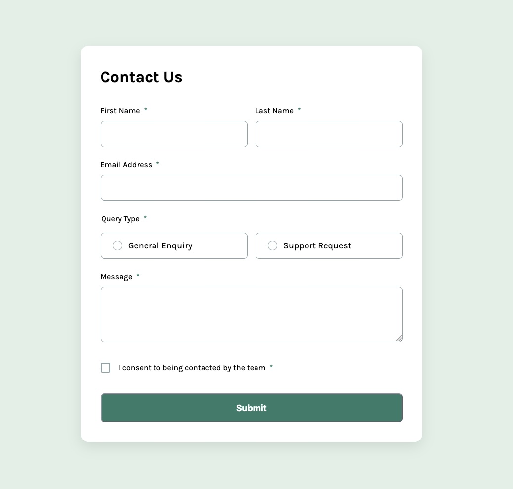

# Frontend Mentor - Contact form solution

This is a solution to the [Contact form challenge on Frontend Mentor](https://www.frontendmentor.io/challenges/contact-form--G-hYlqKJj). Frontend Mentor challenges help you improve your coding skills by building realistic projects.

## Table of contents

- [Overview](#overview)
  - [The challenge](#the-challenge)
  - [Screenshot](#screenshot)
  - [Links](#links)
- [My process](#my-process)
  - [Built with](#built-with)
  - [What I learned](#what-i-learned)
  - [Useful resources](#useful-resources)
- [Author](#author)

## Overview

### The challenge

Users should be able to:

- Complete the form and see a success toast message upon successful submission
- Receive form validation messages if:
  - A required field has been missed
  - The email address is not formatted correctly
- Complete the form only using their keyboard
- Have inputs, error messages, and the success message announced on their screen reader
- View the optimal layout for the interface depending on their device's screen size
- See hover and focus states for all interactive elements on the page

### Screenshot

### Links

- Solution URL: [Solution](https://github.com/vince4dev/challenge17)
- Live Site URL: [Live site](https://vince4dev.github.io/challenge17/)

## My process

### Built with

- Semantic HTML5 markup
- CSS custom properties
- Flexbox
- CSS Grid
- Mobile-first workflow
- Javascript

### What I learned

Semantic Structure

- Used `<label>` linked to each field (for="…") and a `<fieldset>/<legend>` for the radio group.
- Enhances accessibility: screen readers can associate text with its field, and radios are logically grouped.

Accessibility

- required on each mandatory field.
- Added aria-describedby to connect error messages to their fields.
- Visible focus (:focus-visible) and sufficient contrast.
- Ensures the form is usable by everyone, including those with visual or cognitive impairments.

Client‑side Validation

- JavaScript checks for values, radio/checkbox state before submission. Adds an invalid class and shows a message below the problematic field.
- Provides instant feedback, avoids unnecessary server requests, and reduces input errors.

Responsive Design

- CSS Grid layout (1×2 on mobile, 2×2 on desktop). Media queries adjust textarea height and field sizes.
- Keeps the form readable and ergonomic across devices (mobile, tablet, desktop).

User Experience

- The “Message” field is a suitably large textarea.
- Submit button clearly visible with hover effect.
- Confirmation toast that fades automatically.
- Users quickly understand what to do, receive immediate feedback, and enjoy a smooth experience.

Performance

- No heavy framework, only CSS 3 + minimal JavaScript.
- input/change events for real‑time validation.
- Fast load, low memory footprint, and a good Lighthouse score.

### Useful resources

- [google-webfonts-helper](https://gwfh.mranftl.com/fonts) - This helped me find the font and integrate it into the project.
- [MDN](https://developer.mozilla.org/fr/) - Resources for Developers.

## Author

- Frontend Mentor - [@vince4dev](https://www.frontendmentor.io/profile/vince4dev)
